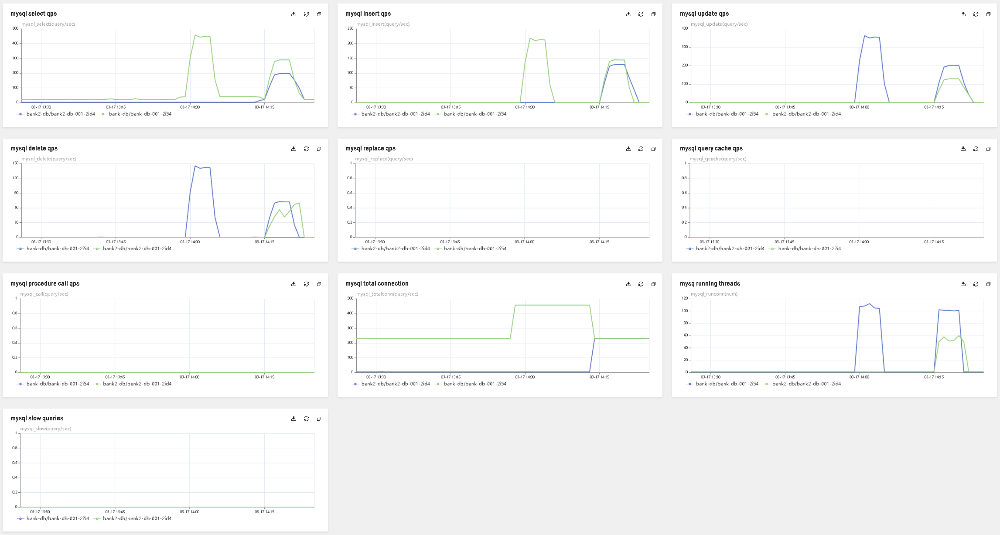
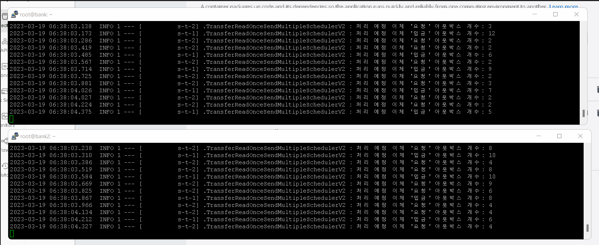
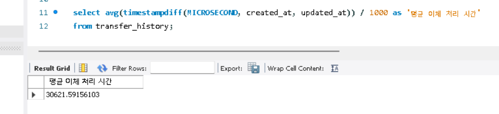
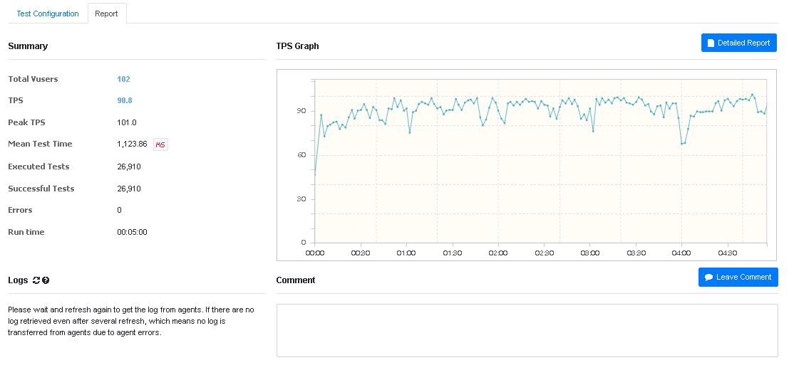
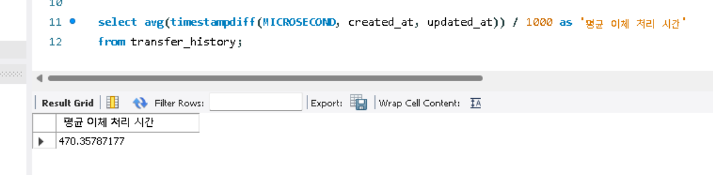
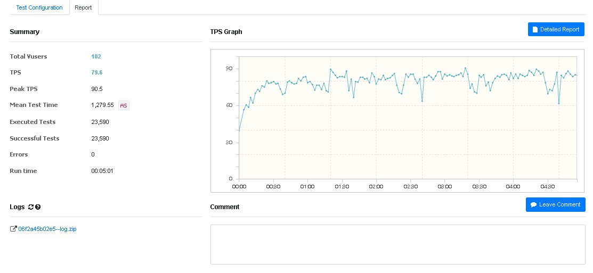

# **bank**
 돈통 및 이체 서비스

# **🤝소개**
- 돈통 및 이체 서비스

# **🕐성능 개선**


# **🌐아키텍처**
- 아키텍처

# **🔧사용 기술**
## Backend
- Java11
- Spring Boot 2.7.0, Spring MVC
- Spring Data JPA
- Junit5, Mockito
- Gradle 7.x

## DevOps
- Ubuntu 20.04
- MySQL
- Github Action
- NCP server, mysql

# **❓기술적 이슈**
## 기술 선택 과정
- why Webclient? not Resttemplate and Openfeign
- Why JPA?
- Why Transactional Outbox pattern?
- Why Polling?
- Why N VUsers?

## 이체 성능 개선기
1. **서버 1개, db 1개 사용, 타행 이체시 localhost로 자체 호출, 스케줄러 전략 4개 시도, 스케줄러 메소드 2개 사용**

   1. @Schduled, @Transactional가 붙은 스케줄러 메서드에서 하나만 락 걸고 읽어와서 처리 후 commit
      ````
       <성능 측정 결과>
       Vusers : 4
       schduler timeDelay = 10ms
       sync
       TransferReadOnceSendOnceScheduler
       tps : 64.0
       이체 처리 평균 시간 33.3초
       ````
   2. @Schduled가 붙은 스케줄러 메서드에서 여러 row에 읽어온 후 각 row를 비동기로 처리함. 비동기 처리 시 락걸고 처리
       ````
       <성능 측정 결과>
       Vusers : 4
       threaPoolSize = 10
       schduler timeDelay = 1000ms
       async Thread = 50개
       TransferReadMultipleSendOnceScheduler
       tps : 51.0
       이체 처리 평균 시간 6.9초
       ````
   3. @Schduled, @Transactional가 붙은 스케줄러 메서드, 여러 row에 락 걸고 읽어와서 관련 로직 처리 후 commit, 동기
       ````
       <성능 측정 결과>
       Vusers : 4
       schduler timeDelay = 100ms
       sync
       TransferReadOnseSendMultipleScheduler
       tps : 38.0
       이체 처리 평균 시간 0.231초
       ````
   4. @Schduled, @Transactional가 붙은 스케줄러 메서드, 여러 row에 락 걸고 읽어와서 관련 로직 처리 후 commit, 비동기
      ````
      <성능 측정 결과>
      Vusers : 4
      schduler timeDelay = 100ms
      async Thread = 50개
      TransferReadOnseSendMultipleSchedulerV2
      tps : 45.0
      이체 처리 평균 시간 0.332초
      ````

2. **서버 2개, db 1개 사용, 스케줄러 전략 2개 시도, 스케줄러 메소드 2개 사용**
   - **이전 문제 상황**: 다수의 outbox 데이터를 non-lock으로 읽어온 후 스케줄러에서 동기로 타행 입금 요청 처리하는 스케줄링 방법(1-3 방법)이 다수의 데이터를 lock으로 읽어온 후 스케줄러에서 비동기로 타행 입금 요청 처리하는 것 보다 이체 처리 평균 시간이 빠름.
   - **원인** : 다수의 타행 입금 요청(네트워크 I/O 호출)을 동기로 실행하면 느리기 때문에 비동기로 실행했지만, 현재 테스트 상황은 localhost로 실행되기 때문에 실제로 무거운 네트워크 I/O가 일어나고 있지 않음. 비동기 작업으로 인한 thread-switching 비용이 더 크다고 판단.
   - **해결 방안** : 당행, 타행 역할을 나누기 위해 서버 한개를 더 올림.
   - **결과**
       1. @Schduled, @Transactional가 붙은 스케줄러 메서드, 여러 row에 락 걸고 읽어와서 관련 로직 처리 후 commit, 동기
        ````
        <성능 측정 결과>
        Vusers : 102
        schduler timeDelay = 100ms
        sync
        TransferReadOnseSendMultipleSchedulerV
        tps : 71.6
        MTT(Mean Test Time) : 1,423ms
        이체 처리 평균 시간 12.397초
        ````
       2. @Schduled, @Transactional가 붙은 스케줄러 메서드, 여러 row에 락 걸고 읽어와서 관련 로직 처리 후 commit, 비동기
        ````
        <성능 측정 결과>
        Vusers : 102
        schduler timeDelay = 100ms
        async Thread = 50개
        TransferReadOnseSendMultipleSchedulerV2
        tps : 71.8
        MTT(Mean Test Time) : 1,417ms
        이체 처리 평균 시간 0.201초

3. **서버 2개, db 2개 사용, 스케줄러 전략 2개 시도, 스케줄러 메소드 2개 사용**
    - **이전 문제 상황**: 실제 환경은 각각의 은행이 자체 서버를 가지고 있음. 따라서 1서버 1DB여야함.
    - **해결 방안** : 타행을 위한 db를 추가함.
    - **결과**
        1. @Schduled, @Transactional가 붙은 스케줄러 메서드, 여러 row에 락 걸고 읽어와서 관련 로직 처리 후 commit, 동기
         ````
         <성능 측정 결과>
         Vusers : 102
         schduler timeDelay = 100ms
         sync
         TransferReadOnseSendMultipleSchedulerV
         tps : 90.4
         MTT(Mean Test Time) : 1,131ms
         이체 처리 평균 시간 39.738초
         ````
        2. @Schduled, @Transactional가 붙은 스케줄러 메서드, 여러 row에 락 걸고 읽어와서 관련 로직 처리 후 commit, 비동기
         ````
         <성능 측정 결과>
         Vusers : 102
         schduler timeDelay = 100ms
         async Thread = 50개
         TransferReadOnseSendMultipleSchedulerV2
         tps : 91.6
         MTT(Mean Test Time) : 1,118ms
         이체 처리 평균 시간 35.354초

4. **서버 2개, db 2개 사용, 스케줄러 전략 2개 시도, 스케줄러 메소드 1개 사용**
    - **이전 문제 상황**: 각 은행 서버를 위한 db를 따로 뒀을 때 이체 처리 평균 시간이 더 짧아져야 하지만 오히려 늘어남.
    - **지표**
      - TPS가 20% 상승
      - DB monitoring screen shot, mysql running thread
        - 
      - 스케줄러 병목 : 2개의 스케줄러 메소드에 로그를 찍어보니 첫번째 스케줄러는 빠른 속도로 아웃박스 이벤트를 처리하여 처리해야 할 이벤트 개수가 25 이하로 유지되지만, 두번째 스케줄러는 처리해야할 이벤트 개수가 점점 늘어남. 즉 병목 존재
      - 두 서버가 모두 이체 입금 요청 & 이체 입금 완료 이벤트 처리를 하는 것을 logs에서 발견
        - 
        - 이체 입금 완료 이벤트가 이체 입금 요청을 한 서버와 연결된 db에 적재되므로, 절반 정도의 이체 입금 완료 이벤트가 NIO 시 자가 호출을 함. 이에 NIO가 의도와 다르게 성능을 많이 아낌.
    - **원인**
      - 이전 보다 더 많은 TPS : 각 은행 서버 마다 db가 붙기 때문에 db 활용 성능이 높아져서 db에 아웃박스 이벤트가 쌓이는 속도는 빨라졌지만, 처리 속도는 그대로이기 때문에 병목이 발생할거라 예상
      - 테스트 케이스가 특정 계좌 A에서 특정 계좌 B로만 가기 때문에 비동기로 각 입금 완료 응답 요청 메소드를 실행해도 전부 동기로 동작함. 입금을 하기 위해선 lock을 거는데, 이때 pessimistic lock을 걸기 때문. 따라서 db가 두개이고 특정 계좌에서 특정계좌로만 이체를 할 경우엔 동기로 작동.
    - **해결 방안**
      1. 스케줄러를 1개로 변경
      2. 병목에 대한 해결(미해결)
    - **결과**
      - 스케줄러를 1개로 변경
          1. @Schduled, @Transactional가 붙은 스케줄러 메서드, 여러 row에 락 걸고 읽어와서 관련 로직 처리 후 commit, 동기
           ````
           <성능 측정 결과>
           Vusers : 102
           schduler timeDelay = 100ms
           sync
           TransferReadOnseSendMultipleScheduler
           tps : 90.8
           MTT(Mean Test Time) : 1,123ms
           이체 처리 평균 시간 30.621초
           ````
           
           
          2. @Schduled, @Transactional가 붙은 스케줄러 메서드, 여러 row에 락 걸고 읽어와서 관련 로직 처리 후 commit, 비동기
           ````
           <성능 측정 결과>
           Vusers : 102
           schduler timeDelay = 100ms
           async Thread = 50개
           TransferReadOnseSendMultipleSchedulerV2
           tps : 79.5
           MTT(Mean Test Time) : 1,279ms
           이체 처리 평균 시간 0.470초
           ````
           
           

# **🔍순차 다이어그램**
- 업데이트 예정
